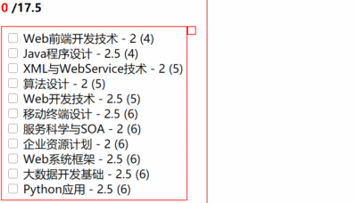

# Homework-01

#### 需求0
为学生提供友好的，动态计算显式选修课学分功能组件  
可以超过17.5，无需限制  
动态显式选择课程学分/总学分  

#### 需求+1
在右侧，动态显式选中的课程  
未达到条件时，累加学分显式红色，达到显式绿色  
由于较简单，不使用讲过的动态绑定class，尝试动态绑定style  
https://vue3js.cn/docs/zh/guide/class-and-style.html#对象语法-2

#### 需求+1
返回的课程不是按学期排序，加入选择数组也是按选择顺序而非学期，体验不好  
按学期排序显式；右侧显式选择的课程也动态按学期排序。不要在视图实现排序  
查询数组排序sort()函数

